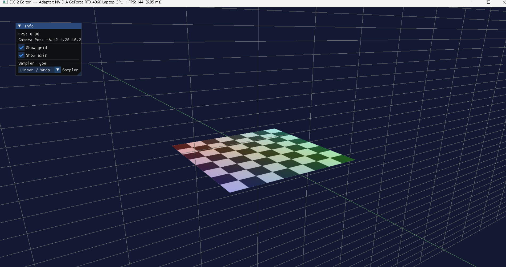
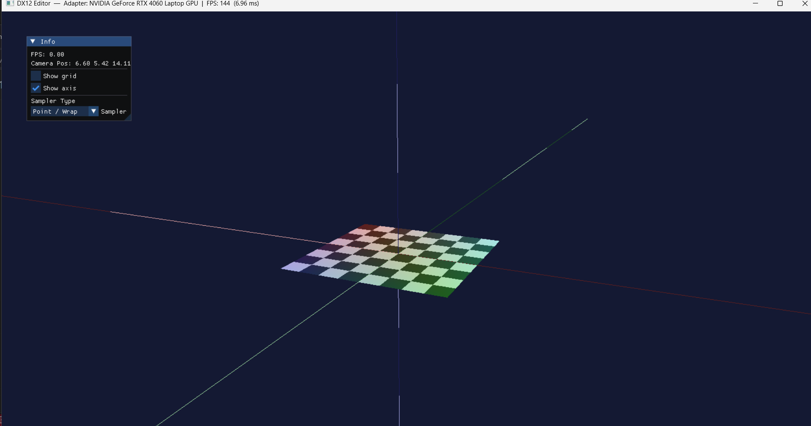

📝 DX12 Texture Viewer / Mini Editor
🎯 Project Overview

This project is a DirectX 12–based mini editor that demonstrates a complete modern rendering pipeline together with essential editor-style camera controls and debugging UI.

It was developed as part of the Advanced Programming for AAA Games course at UPC.

The application provides:

    A textured quad rendered with a procedural checker pattern.

    A full grid + axis helper for world orientation.

    A complete FPS / Orbit camera system.

    Real-time sampling mode switching (4 modes).

    ImGui-based debugging panel.

🖼️ Main Features
✔️ DirectX 12 Rendering Pipeline

The renderer implements a complete, modern DX12 workflow:

    Device + Adapter selection.

    Swap chain & double buffering.

    Command queue, allocator, and command lists.

    Fence synchronization.

    RTV/DSV descriptor heaps & Depth buffer.

    Root signature + Pipeline State Objects (PSO).

✔️ Textured Quad & Sampler Modes

The quad uses UVs to display a checker texture. The user can switch between four texture sampling modes in real-time via the UI:

    Linear / Wrap (Wrap + Bilinear)

    Point / Wrap (Wrap + Point)

    Linear / Clamp (Clamp + Bilinear)

    Point / Clamp (Clamp + Point)

These are implemented via four static samplers in the root signature.
✔️ Editor-Style Camera

The camera offers Unity-like editing behavior with three distinct modes:

    FPS Mode: Standard WASD movement and mouse look.

    Orbit Mode: Rotate around a pivot point.

    Focus Mode: Instantly snaps the camera to the target object.

✔️ ImGui Debug UI

Fully integrated interface providing:

    FPS counter & Camera position data.

    Toggles for Grid and Axis rendering.

    Sampler mode selection (Combo box).

⌨️ Controls
Context	Action	Input
FPS Mode	Look Around	Right Mouse Button + Move
	Move	W / A / S / D
	Elevate / Descend	E / Q
	Fast Movement	Shift
Orbit Mode	Orbit Pivot	Alt + Left Mouse Button
	Zoom	Mouse Wheel
General	Focus on Quad	F
	Toggle Grid/Axis	ImGui Panel
	Change Sampler	ImGui Combo
📁 Project Structure
Plaintext

DX12Editor/
 ├─ ImGui/                      # ImGui backend / sources
 ├─ Resource Files/             # (icons, textures, etc.)
 ├─ Header Files/
 │   ├─ Camera.h
 │   └─ DXMesh.h
 │
 ├─ Source Files/
 │   └─ src/
 │       ├─ App/
 │       │   ├─ Main.cpp
 │       │   ├─ Window.cpp
 │       │   └─ Window.h
 │       │
 │       ├─ Core/
 │       │   ├─ Camera.cpp
 │       │   ├─ d3dx12.h
 │       │   ├─ DXDevice.cpp
 │       │   ├─ DXDevice.h
 │       │   ├─ DXMesh.cpp
 │       │   ├─ DXRenderer.cpp
 │       │   ├─ DXRenderer.h
 │       │   └─ FrameTimer.h/cpp
 │       │
 │       └─ Shaders/
 │           ├─ ColorVS.hlsl
 │           └─ ColorPS.hlsl

⚙️ Technical Implementation Notes
Textures and Mipmaps

    Procedural Generation: The checkerboard texture shown on the quad is generated procedurally in the shader/CPU code. No external image file (png, jpg, dds) is loaded.

    Mipmaps: Because the texture is procedural, there is no offline mipmap generation. When bilinear filtering is selected (MIN_MAG_MIP_LINEAR), hardware mipmap filtering is enabled on the procedural pattern.

Sampler System

    The system uses a 16-byte–aligned CbMvp buffer including a uint samplerIndex.

    Four static samplers are defined directly inside the root signature to handle the different filtering and wrapping modes requested in the assignment.

Other

    ImGui: Fully integrated with a dedicated SRV heap.

    Coordinate System: Camera math uses the Left-Handed Coordinate System (DirectX Standard).

🛠️ Build Instructions
Requirements

    Visual Studio 2022

    Windows SDK

    DirectX 12 capable GPU

    x64 build configuration

Steps to Run

    Open the .sln file in Visual Studio.

    Select Debug / x64 from the configuration manager.

    Build the solution (Ctrl + Shift + B).

    Run DX12Editor.exe.

📸 Screenshots

### Linear / Wrap

### Point / Wrap

🔗 Project Repository

GitHub: https://github.com/ISupertwister/OguzFurkanCelikFirstAssignment

👑 Author

Oğuz Furkan Çelik 
Advanced Programming for AAA Games 
Universitat Politècnica de Catalunya (UPC)
